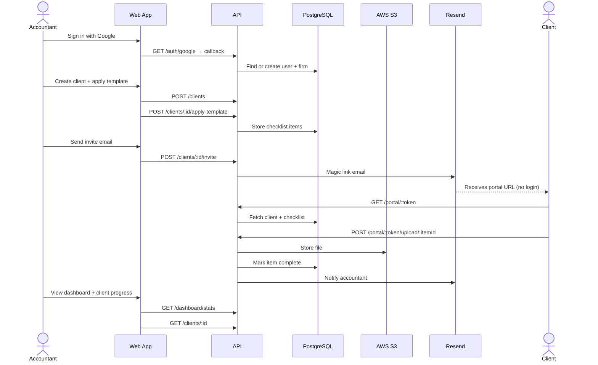
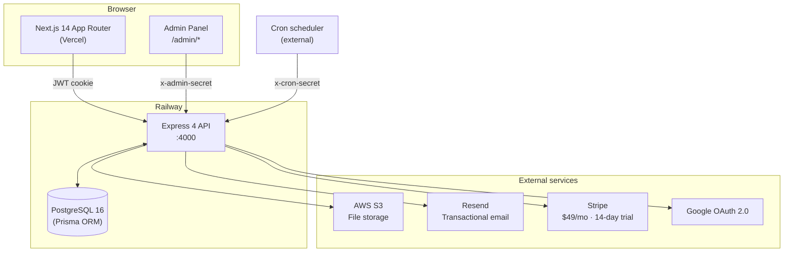
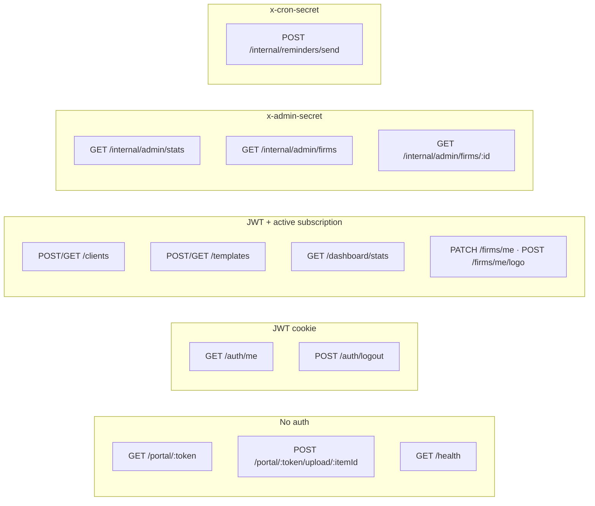

# DocVault

> SaaS for accountants to collect documents from clients.
> Accountants build checklists, send a magic link, clients upload files — no client login required.


---

## Status

| Area                                             | Status              |
| ------------------------------------------------ | ------------------- |
| API — Phases 1–3                                 | ✅ Complete         |
| Web app                                          | ✅ Complete         |
| Admin back office                                | ✅ Complete         |
| CI pipeline (lint · typecheck · test · coverage) | ✅ Active           |
| Production deploy (Railway + Vercel)             | 🔜 Pending env vars |

**Test coverage:** Lines 89% · Functions 100% · Branches 78% — all gates green.

---

## Business flow



---

## Technical architecture



---

## Auth & access control



---

## Stack

| Layer        | Technology                                                   |
| ------------ | ------------------------------------------------------------ |
| API          | Express 4 · TypeScript 5 (strict) · Zod                      |
| Database     | PostgreSQL 16 · Prisma 5                                     |
| Auth         | Google OAuth 2.0 · JWT (HttpOnly cookie)                     |
| File storage | AWS S3 (SDK v3)                                              |
| Email        | Resend                                                       |
| Payments     | Stripe ($49/mo · 14-day free trial)                          |
| Frontend     | Next.js 14 (App Router) · Tailwind CSS · shadcn/ui           |
| Testing      | Vitest · Supertest · aws-sdk-client-mock                     |
| CI           | GitHub Actions (lint · format · typecheck · test + coverage) |
| Deployment   | Railway (API + DB) · Vercel (web)                            |

---

## Quick start

```bash
# 1. Clone and install
git clone <repo> && cd docvault && npm install

# 2. Copy env files and fill in values
cp apps/api/.env.example apps/api/.env
cp apps/api/.env.test.example apps/api/.env.test

# 3. Start infrastructure
docker compose up -d

# 4. Migrate databases
cd apps/api
npm run db:migrate          # dev DB
npm run db:migrate:test     # test DB
cd ../..

# 5. Start dev servers  (API :4000 · Web :3000 · Adminer :8080)
npm run dev
```

---

## CI checks (run on every PR)

| Check            | Command                                |
| ---------------- | -------------------------------------- |
| Prettier format  | `npm run format:check`                 |
| ESLint — API     | `cd apps/api && npm run lint`          |
| ESLint — Web     | `cd apps/web && npm run lint`          |
| TypeScript — Web | `cd apps/web && npx tsc --noEmit`      |
| Tests + coverage | `cd apps/api && npm run test:coverage` |

```bash
# Run all checks locally before pushing
npm run format:check
npm run lint
cd apps/api && npm run test:coverage
cd apps/web && npx tsc --noEmit
```

Coverage gates enforced: **Lines ≥ 80% · Functions ≥ 80% · Branches ≥ 70%**

---

## Project structure

```
docvault/
├── apps/
│   ├── api/                    # Express + TypeScript backend
│   │   ├── src/
│   │   │   ├── routes/         # auth, clients, portal, billing, firms, internal…
│   │   │   ├── services/       # client, upload, notification, billing, reminder…
│   │   │   ├── middleware/     # requireAuth, requireSub, validate, errorHandler
│   │   │   ├── schemas/        # Zod validation schemas
│   │   │   └── test/           # setup, factories, helpers
│   │   └── prisma/             # schema + migrations
│   └── web/                    # Next.js 14 frontend
│       ├── app/
│       │   ├── (auth)/         # /login
│       │   ├── (dashboard)/    # /dashboard, /clients, /settings
│       │   ├── admin/          # /admin, /admin/firms, /admin/firms/[id]
│       │   └── portal/[token]/ # public client portal (no login)
│       └── components/         # ui primitives + feature components
├── .github/workflows/ci.yml    # CI pipeline
├── .prettierrc                 # Prettier config
├── docker-compose.yml
├── package.json                # npm workspaces root
└── CLAUDE.md                   # TDD master plan
```

---

## Development approach

Built **test-first (TDD)** throughout. Full plan, test specs, and phase-by-phase instructions live in [CLAUDE.md](./CLAUDE.md).

Rule: **write a failing test → make it pass with minimum code → refactor → next test.**
